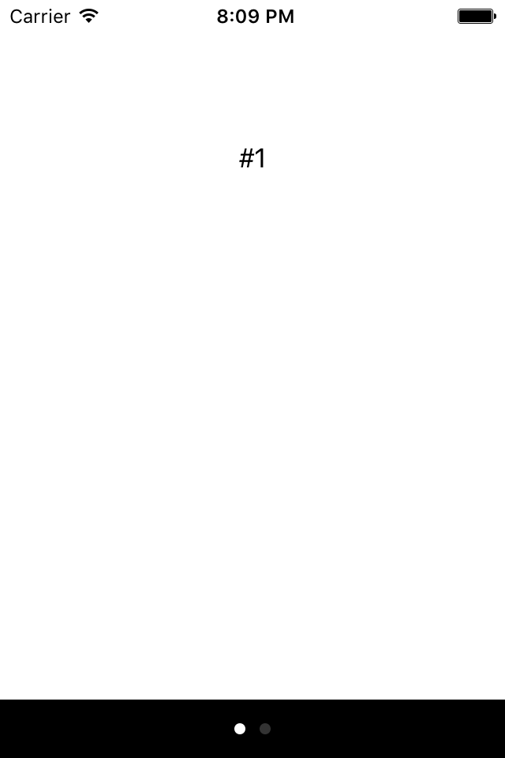

## UIPageViewController

UIPageViewController 提供了按页的用户导航，其中每一个页都可以显示一个独立的视图控制器的视图。可以通过用户手势达到分页导航，也可以使用代码达成导航效果。

我们使用演示代码来学习 UIPageViewController 的使用。一个 UIPageViewController ，包含两个分页，每个分页对应一个 ViewController 。在此代码中，我们做了一个2页的 UIPageViewController ，两个页面都显示一个文字标签，第一页文字为“#1”，第二页文字内容为“#2”。可以使用左滑手势向前翻页，使用右滑手势向后翻页。截图如下：

给类 UIPageViewController 提供数据的 DataSource 协议是 UIPageViewControllerDataSource，其中的一组方法必须实现。说明如下：

1. 返回 ViewController 实例之前的 ViewController 实例
 
 func pageViewController(viewControllerBeforeViewController:) -> UIViewController?

2. 指定 ViewController 实例之后的 ViewController 实例 
 
 func pageViewController(viewControllerAfterViewController:) -> UIViewController?

3. 返回翻页指示器的数量。
 
 func presentationCountForPageViewController() -> Int

4. 初始页索引

 func presentationIndexForPageViewController() -> Int 

## 代码 
    import UIKit

    class VCBase: UIViewController
    {
        
        var label : UILabel?
        override func viewDidLoad()
        {
            super.viewDidLoad()
            
            label = UILabel(frame: CGRectMake(0, 0, view.frame.width, 200))
            label!.textAlignment = .Center
            view.addSubview(label!)
            view.backgroundColor = UIColor.whiteColor()
        }
    }

    class v1: VCBase
    {
        override func viewDidLoad()
        {
            super.viewDidLoad()
            label!.text = "#1"
        }
    }
    class v2: VCBase
    {
        override func viewDidLoad()
        {
            super.viewDidLoad()
            label!.text = "#2"
        }
    }

    class PageViewController :UIPageViewController,UIPageViewControllerDataSource{
        var vcs :[UIViewController]
        required init(){
            vcs = [v1(),v2()]
            super.init(transitionStyle: .Scroll, navigationOrientation: .Horizontal, options: nil)
        }
        required  init?(coder: NSCoder){
            fatalError()
        }
        override func viewDidLoad() {
            self.dataSource = self
            let startingViewController: UIViewController = vcs[0]
            let viewControllers = [startingViewController]
            setViewControllers(viewControllers, direction: .Forward, animated: false, completion: nil)
        }
        func pageViewController(pageViewController: UIPageViewController, viewControllerBeforeViewController viewController: UIViewController) -> UIViewController?
        {
            let v = (viewController)
            let i = vcs.indexOf(v)! - 1
            if i < 0 {
                return nil
            }
            return vcs[i]
        }
        
        func pageViewController(pageViewController: UIPageViewController, viewControllerAfterViewController viewController: UIViewController) -> UIViewController?
        {
            let v = (viewController)
            let i = vcs.indexOf(v)! + 1
            if i > vcs.count - 1 {
                return nil
            }
            return vcs[i]
        }
        
        func presentationCountForPageViewController(pageViewController: UIPageViewController) -> Int
        {
            return vcs.count
        }
        
        func presentationIndexForPageViewController(pageViewController: UIPageViewController) -> Int
        {
            return 0
        }
        
    }

    @UIApplicationMain
    class AppDelegate: UIResponder, UIApplicationDelegate
    {
                                
        var window: UIWindow?
        
        func application(application: UIApplication, didFinishLaunchingWithOptions launchOptions: [NSObject : AnyObject]?) -> Bool {
            self.window = UIWindow(frame: UIScreen.mainScreen().bounds)
            self.window!.rootViewController = PageViewController()
            self.window?.makeKeyAndVisible()
            return true

        }
    }
## 代码说明

1. 首先，把 window!.rootViewController 设置为 PageViewController 的实例。类 PageViewController 继承自 UIPageViewController 。
2.  在 PageViewController 构造函数内，初始化两个页面的 ViewController ,并加入到 ViewController 类型的数组内。并且调用父类的构造函数：

    super.init(transitionStyle: .Scroll, navigationOrientation: .Horizontal, options: nil)
初始化父类实例的切换风格为卷滚（transitionStyle: .Scroll），导航方向为水平（navigationOrientation: .Horizontal）。

3. 在视图装入函数内（viewDidLoad），通过  setViewControllers(direction:animated:completion:) 指定初始可见的 ViewController ，这里就是我们的第一个视图即可。

4. 接下来我们需要实现 UIPageViewControllerDataSource 协议的一组方法。Datasource 协议本节前面已经说明。

5. 两个 ViewController 实例继承了VCBase，基类完成两者的共性代码，就是创建以文字标签并设置对齐和
文本色。在子类分别初始化不同的文字标签值，以便区别两个视图的外观显示。

