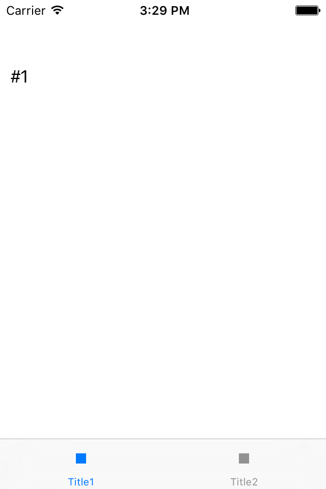

##  UITabBarController

UITabBarController 是一个特别的 ViewController。它在底部显示一个tab bar（标签条）用于单选，每一个tab 对应一个 ViewController 。 系统的闹钟程序就是此 ViewController 的一个案例。UITabBarController通常作为整个程序的 RootViewController，而且不能添加到别的 Container ViewController中。

我们准备做一个最简单的 TabBar 案例 : 它只有两个 tab,分别对应一个 ViewController，点击任何一个 tab 都会显示对应的 ViewController的内容。为了区别，ViewController 内有一个文字标签，内容分别为 #1，#2 。当点击第一个tab时，显示视图控制器vc1的视图，当点击第二个tab时，显示视图控制器vc2的视图。截图是这样的：

## 代码 
    
    import UIKit
    class vc1: UIViewController {
        override func viewDidLoad() {
            super.viewDidLoad()
            let cc = UILabel(frame: CGRectMake(10,50,200,50))
            cc.text = "#1"
            cc.textColor = UIColor.blackColor()
            self.view.addSubview(cc)
        }
    }
    class vc2: UIViewController {
        override func viewDidLoad() {
            super.viewDidLoad()
            let cc = UILabel(frame: CGRectMake(10,50,200,50))
            cc.text = "#2"
            cc.textColor = UIColor.blackColor()
            self.view.addSubview(cc)
        }
    }
    class Tabbar: UITabBarController, UITabBarControllerDelegate {
        override func viewDidLoad() {
            super.viewDidLoad()
            delegate = self
        }
        
        override func viewWillAppear(animated: Bool) {
            viewControllers = [vc1(),vc2()]
            let r = UIImage.imageWithColor(UIColor.blackColor())
            viewControllers![0].tabBarItem = UITabBarItem(title: "Title1",
                            image:r,
                tag:0)
            viewControllers![1].tabBarItem = UITabBarItem(title: "Title2",
                image: r,
                 tag:1)

        }
        
        //Delegate methods
        func tabBarController(tabBarController: UITabBarController, didSelectViewController viewController: UIViewController) {
            print("did select viewController: \(viewController.tabBarItem.tag)")
        }
    }
    @UIApplicationMain
    class AppDelegate: UIResponder, UIApplicationDelegate {
        var window: UIWindow?
        func application(application: UIApplication, didFinishLaunchingWithOptions launchOptions: [NSObject: AnyObject]?) -> Bool {
            self.window = UIWindow(frame: UIScreen.mainScreen().bounds)
            self.window!.rootViewController = Tabbar()
            self.window!.rootViewController!.view.backgroundColor = UIColor.whiteColor()
            self.window?.makeKeyAndVisible()
            return true
        }
    }

## 代码说明

1. 类 AppDelegate 和 `hello app` 一节提到的改造类似，除了  self.window!.rootViewController 改成我们自己的 Tabbar。
2. Tabbar 继承于 UITabBarController ，并在方法 viewWillAppear 内实现初始化：创建两个 ViewController （vc1，vc2），并加入 UITabBarController 的数组 viewControllers内。然后设置它们的 tabBarItem，以便显示文字标签和图片。
3. Tabbar 还实现委托 UITabBarControllerDelegate ,以便在发生事件时可以得到通知。为了演示目的，我们实现了 tabBarController(didSelectViewController：），当选择完成后会执行此方法。
4. vc1，vc2 都继承于 UIViewController，并可以在方法 viewDidLoad 内完成初始化。我们这里仅仅加入一文字标签以便区别两个 ViewController 。

