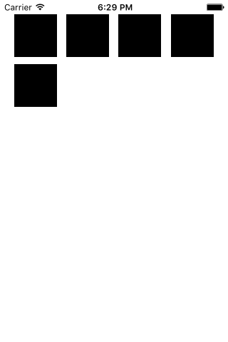

## UICollectionView

## 代码
    class DemoCollectionView: UIViewController, UICollectionViewDelegateFlowLayout, UICollectionViewDataSource {
        var collectionView: UICollectionView!
        override func viewDidLoad() {
            super.viewDidLoad()
            let layout: UICollectionViewFlowLayout = UICollectionViewFlowLayout()
            layout.sectionInset = UIEdgeInsets(top: 20, left: 20, bottom: 20, right: 20)
            layout.itemSize = CGSize(width: 60, height: 60)
            
            collectionView = UICollectionView(frame: self.view.frame, collectionViewLayout: layout)
            collectionView.dataSource = self
            collectionView.delegate = self
            collectionView.registerClass(UICollectionViewCell.self, forCellWithReuseIdentifier: "Cell")
            collectionView.backgroundColor = UIColor.whiteColor()
            self.view.addSubview(collectionView)
        }
        func collectionView(collectionView: UICollectionView, numberOfItemsInSection section: Int) -> Int {
            return 5
        }
        
        func collectionView(collectionView: UICollectionView, cellForItemAtIndexPath indexPath: NSIndexPath) -> UICollectionViewCell {
            let cell = collectionView.dequeueReusableCellWithReuseIdentifier("Cell", forIndexPath: indexPath)
            cell.backgroundColor = UIColor.blackColor()
            return cell
        }
    }

    @UIApplicationMain
    class AppDelegate: UIResponder, UIApplicationDelegate {
        var window: UIWindow?
        func application(application: UIApplication, didFinishLaunchingWithOptions launchOptions: [NSObject: AnyObject]?) -> Bool {
            self.window = UIWindow(frame: UIScreen.mainScreen().bounds)
            self.window!.rootViewController = DemoCollectionView()
            self.window?.makeKeyAndVisible()
            return true
        }
    }
## 代码说明
