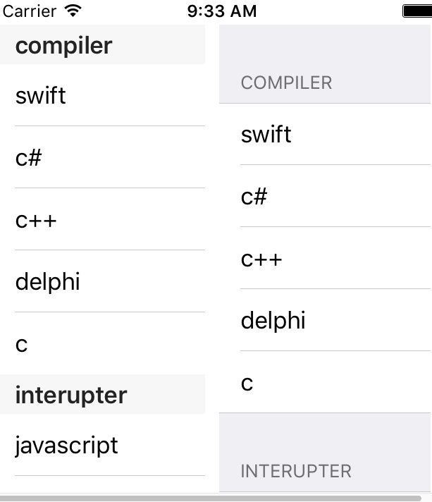

## tableview 风格

tableview可以在创建实例时选择不同的风格：选择 plain 或者 group。选择 plain 风格的话，section 的头部和尾部视图会浮动显示在tableview的头部和尾部，不会随着tableview的滚动而移动位置。选择 group 风格的话，不同的 section 会有明显的显示区别，当滚动 tableview 的时候，section的头部和尾部视图也不会浮动，而是和其他的行一起滚动。

依然以我喜欢的语言列表为例，这次为了演示 section，我把语言分为两组，一组是编译型的，一组是解释型的。原始数据为：

    let arrs = [
        ["swift","c#","c++","delphi","c"],
        ["javascript","php","python","ruby","tcl/tk","bash"]
        ]

数组titles 则作为section 的头视图文字标签：

    let titles  = ["compiler","interupter"]

最后的显示效果是这样的：

除了静态图片显示的视觉差别外，还有动态的效果差别。为了查看前文提及的头部视图的浮动效果，可以在执行在虚拟机上时，用鼠标按住 table view 内容，然后拖动。如果是实体手机上，可以用手指拖动 tableview 内容。

## 达到以上效果的代码

    let arrs = [["swift","c#","c++","delphi","c"],["javascript","php","python","ruby","tcl/tk","bash"]]
    let titles  = ["compiler","interupter"]
    class LangTablePlain : UITableView,UITableViewDataSource{
        convenience init(){
            self.init(frame: CGRectZero, style:UITableViewStyle.Plain)
        }
        override init(frame: CGRect, style: UITableViewStyle) {
            super.init(frame:frame,style:style)
            self.dataSource = self
            
        }
        required init?(coder aDecoder: NSCoder) {
             fatalError("NSCoding not supported")
        }
        func tableView(tableView: UITableView, numberOfRowsInSection section: Int) -> Int {
            if section == 0 {
                return arrs[0].count
            }else{
                return arrs[1].count
            }
        }
        func tableView(tableView: UITableView, cellForRowAtIndexPath indexPath: NSIndexPath) -> UITableViewCell{
            let a = UITableViewCell(style: UITableViewCellStyle.Value1, reuseIdentifier: nil)
            a.textLabel?.text = String(arrs[indexPath.section][indexPath.row])
            return a
        }

        func numberOfSectionsInTableView(tableView: UITableView) -> Int{
            return 2
        }
        func tableView(tableView: UITableView, titleForHeaderInSection section: Int) -> String?{
            return titles[section]
        }
    }
    class LangTableGrouped : UITableView,UITableViewDataSource{

        convenience init(){
            self.init(frame: CGRectZero, style:UITableViewStyle.Grouped)
        }
        override init(frame: CGRect, style: UITableViewStyle) {
            super.init(frame:frame,style:style)
            self.dataSource = self
            
        }
        required init?(coder aDecoder: NSCoder) {
            super.init(coder:aDecoder)
        }
        func tableView(tableView: UITableView, numberOfRowsInSection section: Int) -> Int {
            if section == 0 {
                return arrs[0].count
            }else{
                return arrs[1].count
            }
        }
        func tableView(tableView: UITableView, cellForRowAtIndexPath indexPath: NSIndexPath) -> UITableViewCell{
            let a = UITableViewCell(style: UITableViewCellStyle.Value1, reuseIdentifier: nil)
            a.textLabel?.text = String(arrs[indexPath.section][indexPath.row])
            return a
        }
        func numberOfSectionsInTableView(tableView: UITableView) -> Int{
            return arrs.count
        }
        func tableView(tableView: UITableView, titleForHeaderInSection section: Int) -> String?{
            return titles[section]
        }
    }

    func PlainVsGrouped (view: UIView){
        let a  = LangTablePlain()
        a.frame = CGRectMake(0,20,150,500)
        view.addSubview(a)
        
        let b  = LangTableGrouped()
        b.frame = CGRectMake(160,20,150,500)
        view.addSubview(b)
    }

为了在主界面看到，需要找到ViewController 的 viewDidLoad 内贴入 ：

    PlainVsGrouped(self.view)

贴入后 的效果是这样的：

    class ViewController: UIViewController {
        override func viewDidLoad() {
            super.viewDidLoad()
            PlainVsGrouped(self.view)
        }
    }
## 代码说明

我们依然采用LangTable类为原型，但是在Datasource 成员

1. tableView:numberOfRowsInSection: 
2. tableView:cellForRowAtIndexPath:

之外，为了支持多个 section而引入了 Datasource 的其他两个成员的实现：

1. numberOfSectionsInTableView: 。用来告诉 tableview应该显示的Section的数量。
2. tableView:titleForHeaderInSection: 用来告诉 tableview 每个Section 的头文字标签

为了清晰的看到两者的差别，我们把两个 tableview 并列于一个单屏内显示。

