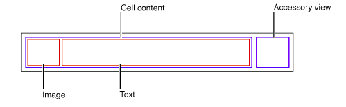
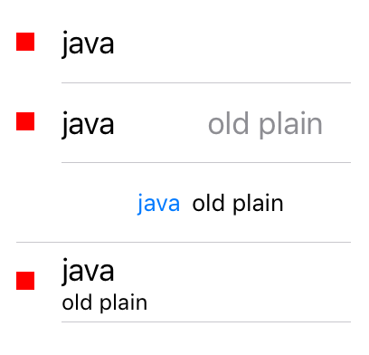

## table cell 风格

引入章节已经提到了默认的Cell风格。此风格下，Cell 内容视图的布局是左侧为一个image view，右侧内容为一个文字标签，像是这样：

完整的风格定义是一个枚举类型，有 4 个可选值构成，定义为：

    public enum UITableViewCellStyle : Int {        
        case Default
        case Value1 
        case Value2 
        case Subtitle 
    }

Default 我们已经谈过，接下里看另外三个值的含义：

    - Value1 左侧的一个左对齐的标签、右侧的一个右对齐标签文字颜色为蓝色。
    - Value2 左侧的一个右对齐的蓝色文字标签、右侧的一个左对齐文字标签。
    - Subtitle 上侧一个左对齐的标签，下侧一个灰色文字标签

使用预定义风格的 Cell，我们可以得到简单的、整齐划一的 Cell 内的控件和布局。当然我们可以做定制的 Cell 风格。随后会就此话题展开。

## 代码

这段代码显示了 4 行，Cell 对象内的主要文字标签(textLabel)，次要文字标签(detailLabel)和图片视图（imageView ）都是一样的，但是4个行选择的Cell 风格不同，我们可以对比的看到不同的风格对内部视图的位置摆放的不同。

    class LangTableCellStyle: UITableView,UITableViewDataSource{
        class Row {
            var text : String = ""
            var text2 : String = ""
            var image : UIImage
            var style :  UITableViewCellStyle
            init( text : String ,text2:String ,image:UIImage,style :  UITableViewCellStyle){
                self.text = text
                self.text2 = text2
                self.image = image
                self.style = style
            }
        }
        let arr = [
            Row(
                text:"java",
                text2:"old plain",
                image:UIImage.imageWithColor(UIColor.redColor()),
                style: UITableViewCellStyle.Default),
            Row(
                text:"java",
                text2:"old plain",
                image:UIImage.imageWithColor(UIColor.redColor()),
                style: UITableViewCellStyle.Value1),
            Row(
                text:"java",
                text2:"old plain",
                image:UIImage.imageWithColor(UIColor.redColor()),
                style: UITableViewCellStyle.Value2),
            Row(
                text:"java",
                text2:"old plain",
                image:UIImage.imageWithColor(UIColor.redColor()),
                style: UITableViewCellStyle.Subtitle)
        ]
        override init(frame: CGRect, style: UITableViewStyle) {
            super.init(frame:frame,style:style)
            self.dataSource = self
            
        }
        required init?(coder aDecoder: NSCoder) {
            super.init(coder:aDecoder)
        }
        func tableView(tableView: UITableView, numberOfRowsInSection section: Int) -> Int {
            return arr.count
        }
        
        func tableView(tableView: UITableView, cellForRowAtIndexPath indexPath: NSIndexPath) -> UITableViewCell {
            let a = UITableViewCell(style: arr[indexPath.row].style, reuseIdentifier: nil)
            a.textLabel?.text = arr[indexPath.row].text
            a.detailTextLabel?.text = arr[indexPath.row].text2
            a.imageView?.image = arr[indexPath.row].image
            return a
        }
        class func dock(view : UIView){
            let t = LangTableCellStyle();
            t.frame = CGRectMake(0,100,200,300)
            view.addSubview(t)
        }
        
    }
把这个定制的 table view 视图插入到view controller 内的方法是 ：

     LangTableCellStyle.dock(self.view)

此方法是一个类方法，可以让类和外部代码的接口更简单。加入此方法的view controller 代码看起来是这样的：

    class ViewController: UIViewController {
        override func viewDidLoad() {
            super.viewDidLoad()
            LangTableCellStyle.dock(self.view)
        }
    }
为了方便阅读，我也给出了本例代码运行后的截图：

