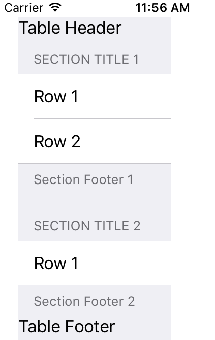

## table view 外观全揽

在前些节的基础上，我们可以对 tableview UI的元素构成做完整的理解，以便更好适应具体应用的不同的情形。

tableview 有很多行，每个行有且仅有自一列，这个列被称为 Cell。行可以分组为Section。每个Section上下又分別有Header和Footer，许多个的Section则组成了整个Table ，当然Table也有Header和Footer。

配合文字看看这张图，便于你的理解：

这张截图，对应的代码在随后一节。

## 代码

我们依然会采用代码来验证效果：

    class LangTableTotalUI : UITableView,UITableViewDataSource{
        let arrs = [["Row 1","Row 2"],["Row 1"]]
        let titles  = ["Section Title 1","Section Title 2"]
        let footers  = ["Section Footer 1","Section Footer 2"]
        let tableheader = "Table Header"
        let tablefooter = "Table Footer"
        convenience init(){
            self.init(frame: CGRectZero, style:UITableViewStyle.Grouped)
        }
        override init(frame: CGRect, style: UITableViewStyle) {
            super.init(frame:frame,style:style)
            self.dataSource = self
            self.tableHeaderView = UIView()
            self.tableHeaderView!.frame = CGRectMake(0, 0,200,20)
            let l = UILabel()
            l.text = tableheader
            l.frame = CGRectMake(0, 0,200,20)
            self.tableHeaderView?.addSubview(l)
            
            self.tableFooterView = UIView()
            self.tableFooterView!.frame = CGRectMake(0, 0,200,20)
            let f = UILabel()
            f.text = tablefooter
            f.frame = CGRectMake(0, 0,200,20)
            self.tableFooterView?.addSubview(f)
        }
        required init?(coder aDecoder: NSCoder) {
            super.init(coder:aDecoder)
        }
        func tableView(tableView: UITableView, numberOfRowsInSection section: Int) -> Int {
                return arrs[section].count
        }
        func tableView(tableView: UITableView, cellForRowAtIndexPath indexPath: NSIndexPath) -> UITableViewCell{
            let a = UITableViewCell(style: UITableViewCellStyle.Value1, reuseIdentifier: nil)
            a.textLabel?.text = String(arrs[indexPath.section][indexPath.row])
            return a
        }
        func numberOfSectionsInTableView(tableView: UITableView) -> Int{
            return arrs.count
        }
        func tableView(tableView: UITableView, titleForHeaderInSection section: Int) -> String?{
            return titles[section]
        }
        
        func tableView(tableView: UITableView, titleForFooterInSection section: Int) -> String?{
            return footers[section]
        }
        class func dock(view : UIView){
            let b  = LangTableTotalUI()
            b.frame = CGRectMake(20,20,150,500)
            view.addSubview(b)
        }
    }

    class ViewController: UIViewController {
        override func viewDidLoad() {
            super.viewDidLoad()
            LangTableTotalUI.dock(self.view)
        }
    }

## 代码说明

引入了一个便利构造函数，在此构造函数中，为了方便查看，我们使用的是 group 风格的 tableview ，并且把 tableview的frame初始化为 CGRectZero，就是一个所有成员都为 0 的矩形。tableview 的真实位置由frame 成员来设置。

        convenience init(){
            self.init(frame: CGRectZero, style:UITableViewStyle.Grouped)
        }

定制每个 section的头视图（Section Header）的使用：

        tableView:titleForHeaderInSection:

定制每个 section的尾视图（Section Footer）的使用：

        tableView:titleForFooterInSection: 
为了在 table view 的头显示文字，tableview提供了 tableHeaderView 视图。默认情况下它是nil。可以自己创建一个视图，并且把任何其他视图加入它的子视图内。实际的做法就是在构造函数内加入一个UILabel作为子视图：

        self.tableHeaderView = UIView()
        self.tableHeaderView!.frame = CGRectMake(0, 0,200,20)
        let l = UILabel()
        l.text = tableheader
        l.frame = CGRectMake(0, 0,200,20)
        self.tableHeaderView?.addSubview(l)

为了在 table view 的尾视图内显示文字的做法和头视图内的显示方式是一致的。

