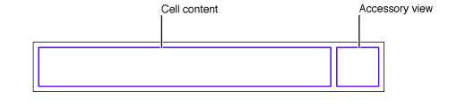
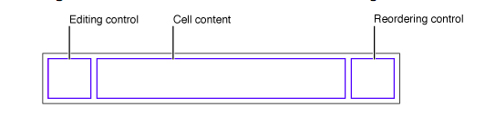

introduction

table view 的 cell 默认模式下，内部布局是这样的：

其中右侧的 accessory view 被保留用来显示  disclosure indicators, detail disclosure controls,或者放置定制的控件。左侧的为Cell的内容视图（content）。在编辑模式下，内部布局就是不同的了：

在左侧会引入一个编辑控件，包括删除和插入控件。前者看起来是在一个圈内显示的一个红色减号，后者看起来是在一个圈内显示的一个绿色加号。如果Cell 的 showsReorderControl 属性设置为 true，那么在最右侧会出现一个 Reorder 控件，它看起来是一个矩形，内部有三根水平灰线。