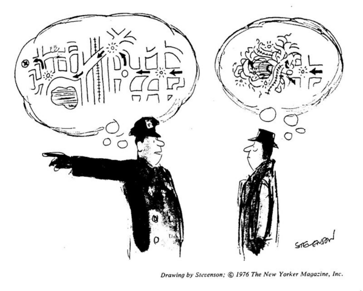

在某文中，我看到“知识的诅咒“，就立刻被它吸引住了。好像是因为知识+力量见的多了，也好像是诅咒+巫术相连，，那就没有问题。然而，偏偏知识就手拉手诅咒了。有点像是关公和秦琼走在大街上还tm手拉手的那样。

知识的诅咒（The Curse of Knowledge）,在wikipedia中描述为：”是一种认知偏差，亦为专家常以术语交谈，但是丧失与非专业人士沟通的能力“。指的是，人们千难万险的在获得了某种知识之后，就会立即忘掉以前的各种百思不得其解的疑问，无法理解和想象和曾经的自己处于相似情况的其他人类的感受。

问路就是一个案例。一个从未去过的陌生城市，你向当地人问路。当地人认真的讲清楚，可你还是不明白怎么走。

所以，这个概念感觉就是无意的过河拆桥。为了到达对岸，需要搭桥铺路，然而一旦过了河，桥就自己消失了。因此，即使世界上并没有巴别塔，知识的诅咒也会强大而隐形的制造出知识传递的困难。

写书是一种知识传递。写书的目的是将这些知识传递给那些不具备此知识的人，而根据“知识的诅咒”，你又无法确知那些初学者会遇到哪些问题！唯有找初学者（并且尽可能多）来试读。

有一段时间，我发现我常常可以发现别人的错别字。一目了然，就像玻璃上趴着的一只苍蝇。然后我提出后，发现他好像恍然大悟，啊真的是。我一直以为他不认真，直到我也被找到，运气到了我自己，我也觉得奇怪。很平常的一个字啊，怎么会？然后，我慢慢了解到，写作者要查自己的错别字很难，阅读者却很容易。哪怕两者之间可能在教育资格上，专业能力上差别很大也是如此。

从这个角度看来，程序员的编码评审则是一个充满智慧的设计。首先代码作者写完代码后，会觉得一些都是顺理成章的。完全无法很好地发现可能错误的假设或者糟糕的数据结构组织。而对评审者来说，这就容易的多了。他只要对照现在的方案和自己本来的计划（再小的代码块，计划和实际情况也会有些差别），并且熟练若干固定招式，就可以反复使用，效果极佳。

笔记于： http://mindhacks.cn/2012/06/04/escape-from-your-shawshank-part5-the-invisible-cage/

http://mindhacks.cn/2010/03/18/escape-from-your-shawshank-part3/

